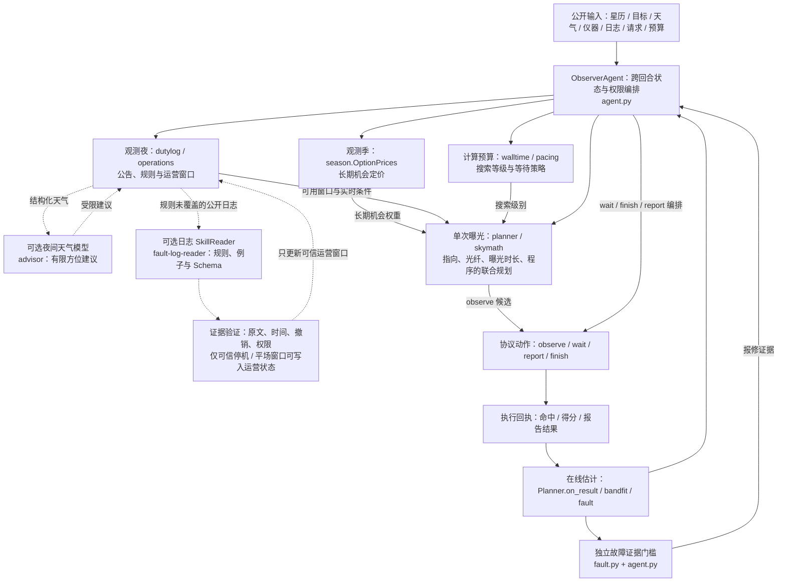

# 观天识时，择机而动
## 从天文观测智慧到自主智能体设计

**The Sky Is Not a Queue**  
*An Astronomy-Inspired, Evidence-Grounded Autonomous Observer*  
**作者团队：** DeepSpace

> **天文学探索如何从有限的观测中建立对宇宙的可靠认识；Agent 工程探索如何在不完备的信息与动态变化的环境中，实现自主而可信的决策。** 两者看似分别关乎认识与行动，却共享着相似的方法论：尊重客观约束、显式处理不确定性、依靠证据修正判断，并通过持续反馈提升系统的可靠性。
我们尝试将这种共通的方法论转化为具体的工程架构：以物理模型限定可行域，以优化算法分配有限资源，以语言模型理解非结构化信息，以观测反馈校正决策。
在这里，天文学不只是 Agent 的应用场景，也是其设计原则的重要灵感来源。

### 项目摘要

天空不是一个按顺序等待执行的任务队列。地球自转与季节变化决定了观测窗口，月光和大气改变信号质量，焦面上的光纤几何限制了一次曝光能够获得的数据。某个目标即使价值很高，也未必值得现在观测；一条自然语言公告即使看似可信，也不足以直接授权停机或报修。

DESI、PFS 等现代巡天已建立高水平的自动选场、观测规划、光纤配置与质量反馈体系。我们并不试图用 LLM 重造这些成熟的专业算法，而是探索下一层工程问题：**当目标的长期价值、临时运营信息和实时执行状态同时变化时，如何将可靠的局部自动化组织为可信的整体自主性？**

我们据此构建了一个**分层规划、闭环校准、证据约束、预算自适应**的自主观测 Agent。观测季层估计未来供需和机会成本，将长期稀缺性压缩为短期决策可使用的价值权重；曝光层把指向、光纤分配、曝光时长和程序作为相互耦合的行动，在天球几何、天气和运维约束下求解；反馈层用真实命中与质量回执修正效率、指向和故障证据；语言模型则作为非结构化信息的解释接口，输出必须经过结构、时效和来源校验，不能绕过确定性决策链；计算预算层根据剩余资源调整搜索深度，必要时有意识地等待。**长期价值的计算主要由优化器承担；LLM 负责补充语言理解，而不替代物理与数学决策。**

其中，`fault-log-reader` Skill 将天文台领域规则与日志范例封装为可校验的知识契约，让模型在不整齐的值班记录中提出结构化事件候选；事件能否进入运营状态，仍由原文与时间校验决定。各个模块拥有**清晰而有限的责任**：物理定义可能，规划决定值得，观测检验判断，证据约束权限。系统追求的不是没有边界的“聪明”，而是**有约束、可反馈、可追溯的自主性**。

---

## 一、设计命题：从天文学的时间观，到 Agent 的控制结构

传统任务调度常假定工作项可以排队：当前任务未完成，下一轮继续尝试。然而巡天中的“时间”并非均匀的容器。目标随地球自转改变高度角，月光与天气改变有效曝光效率，一个天区本季失去的窗口不一定能由下一个夜晚补偿。**时间不仅决定何时行动，也决定行动本身的价值。**

这引出一个比“下一步选什么”更基础的系统问题：在信息持续到达、资源不断消耗的环境里，怎样让 Agent 的每次局部行动不偏离长期科学目标？我们没有把全部复杂性塞入一个巨大的提示词或一次性优化，而是采用**分层决策（hierarchical decision-making）与滚动重规划（receding-horizon planning）**的思路：远期层评价机会，近期层作出完整动作，执行回执反过来修正下一次判断。这里的“滚动”描述每回合更新决策的工程机制，并不宣称实现了具有最优性保证的模型预测控制。

### 1.1 当观测已经高度自动化，为什么还需要 Agent？

答案首先不是“传统自动化不够智能”。DESI 已经把下午规划、夜间自动选场、动态曝光完成度估计、次日质量检查与目标列表更新接成可靠的业务闭环；PFS 也将巡天规划、光纤配置、仪器控制和数据系统以明确的职责边界组织起来。这些都是本项目的**工程起点，而非待被推翻的旧方案**。[DESI: Schlafly et al. 2023](https://arxiv.org/abs/2306.06309)；[PFS: Shimono et al. 2016](https://arxiv.org/abs/1608.01163)。

问题发生在更高的**决策协调层（decision orchestration layer）**：当观测机会跨季节变化，临时请求与运维公告不断到达，模型、仪器与计算预算的可信状态又在每次行动后被改写，怎样让不同时间尺度的优化器共享必要信息，却不侵入彼此的职责？这里引入 Agent，是为了构建一个持续维护状态、整合证据、重规划并回收执行反馈的自主控制器，而非给望远镜增加一个会聊天的操作员。

**长期一致性是引入 Agent 的核心动机之一，但不是 LLM 的独有贡献。** 传统巡天本来就有长期规划。我们在 `season.py` 中使用启发式机会定价，把未来可见窗口和供需压力折算为 `planner.py` 可以使用的软权重；它改善的是不同时间尺度的协同表达，既不等价于求得整季全局最优，也尚无独立消融证据证明这一设计的净增益。即使完全关闭语言模型，这条物理规划与反馈控制链仍然成立。

**引入 LLM 的理由则不同：为开放格式的信息提供有边界的语义适配能力。** 值班日志、天气公告、临时更正和模糊叙述很难保证始终符合固定协议；依赖逐条添加规则，维护成本会随输入样式增长。我们让规则先处理确定性的内容，仅在允许且必要时让模型提出结构化解释，再通过原文、时间、权限与版本校验进入运营状态。LLM 不负责求解光纤几何，也没有权力直接签发高成本报告。

所以，这里的新增价值不是“AI 比调度器更会选目标”，而是**将成熟的领域自动化、跨时域的价值协调和非结构化信息理解，以可验证的接口组合为一个自主系统**：让优化器精于计算，让语言模型善于解释，让控制器负责取舍。

整套设计可以概括为四条原则：

1. **以约束塑造行动空间，而不是事后修补非法行动**（constraint-aware action design）。
2. **以契约连接异构能力，而不是让每个模块拥有完整权限**（contract-based composition）。
3. **以观测反馈更新内部估计，而不是假定模型永远正确**（closed-loop estimation）。
4. **把计算、等待和失效路径纳入设计，而不是只优化理想状态**（resource-aware autonomy and graceful degradation）。

工程上的优美往往表现为一种克制：每一层只处理自己能够可靠回答的问题，并向下一层输出足够、但不过量的信息。

## 二、系统架构：三个时间尺度、一条反馈回路、两道约束边界

### 2.1 三个时间尺度

**观测季尺度——机会定价，而非逐夜枚举。** `season.py` 的 `OptionPrices` 综合天区剩余目标价值、恒星时可见性、有限光纤供给与未来时段供需，给出相对机会权重。它不直接决定下一次望远镜指向，而是把“未来还有多少选择”凝练成当前决策能够消费的信号。长期规划因而无需侵入每一次曝光的几何细节。

**观测夜尺度——把外界变化转化为运营约束。** `agent.py` 接收天气通告、限时观测请求与值班信息；`dutylog.py`、`operations.py` 等模块处理可确定的时间窗口和地形信息，模型辅助模块在启用且可用时解释较难解析的非结构化消息。本次运行配置中的 `V7_NIGHTPLAN=on` 指**模型辅助的本夜天气/方位建议**，不是启用 `nightsched.py` 的整夜组合优化。

**单次曝光尺度——在可行域内形成可执行命令。** `planner.py` 联合比较指向、光纤、时长和 `DARK / BRIGHT / BACKUP` 模式。先用便宜的天区价值与可见性代理筛选候选，再做详细几何和收益评价。搜索细节可以因预算收缩，但生成动作必须满足同一套物理与协议条件。

这是一种**快慢变量解耦**：季节层改变价值，夜间层改变可用性，曝光层决定动作。系统不必在每一秒重算整季，也不应让长期最优性的幻想阻碍当下可执行的指令。

### 2.2 一条跨回合的反馈回路



图示表示**逻辑职责与信息流**，不是逐行函数调用顺序：实线是程序化规划与反馈主链，虚线是可选的语言理解路径。`fault-log-reader` Skill 在 v72 中通过 `V7_SKILL=1` 允许启用，但只有规则尚未解决的公开日志行、模型可用且预算允许时才可能提交模型调用；它不能直接改写全部观测条件。经严格验证后，当前 `operations.accept_skill()` 只接纳原文可核验的**停机与平场窗口**。`report` 不由曝光规划器、Skill 或天气模型直接产生，而须满足 `fault.py` 的证据门槛及 `agent.py` 的报告策略。v72 未开启 `strategist.py` 的中期参数控制，因而架构保持三个时间尺度。

Agent 的完整性不取决于是否拥有许多互相对话的“子人格”，而在于它是否能够**跨回合保存状态、生成完整动作、消费真实反馈，并在约束变化时重新决策**。本项目是一个有状态控制器组合多个领域能力模块，而不是把模块名称包装成多 Agent 对话。

### 2.3 两道边界与一个决策契约

**第一道是物理边界。** 天体高度角、地形遮挡、月光、视场、光纤网格、可用曝光时间与运维关闭窗口共同构成可行域。一个数学上收益高的动作，如果光纤无法覆盖目标或者观测窗口不足，就不应作为候选命令。

**第二道是证据边界。** 非结构化信息需要原文支持、有效时间、权威性和撤销状态；故障报告需要持续性或效率区间等观测证据。语言模型可以协助解释，但不能凭措辞的确定性代替数据的确定性。

行动以结构化契约输出，而不是自由文本指令：

```text
Decision := Observe(pointing, assignments, duration, program)
          | Wait(until)
          | Report(reason)
          | Finish
```

这是一种便于理解的接口表示；实际实现使用 `participant-agent-protocol-v4` 的 JSON 消息与 `jsonl-v2` 传输，并非上式对应的静态类型系统。**接口保持简单，是因为复杂性已经在接口之前被消化；输出保持严格，是因为执行者不应替规划器猜测意图。**

---

## 三、五项关键工程设计：天文学知识如何成为系统能力

### 3.1 观天识时｜Hierarchical planning：把未来压缩为当前的机会成本

在天文学中，“现在是否值得观测”不能只由单个目标的当前分数回答。同一科学价值的两片天区，一片可能很快失去本季窗口，另一片还会在未来多个夜晚处于高质量时段。它们的机会成本不同。

`OptionPrices` 用天区分组与未来时段的供需近似，为剩余工作量分配软时间价格，再通过 `mult_now()` 影响实时目标价值。这接近资源分配中**影子价格（shadow-price-like signals）**的思想：不要求下层规划器理解完整未来，只需把未来的资源稀缺性作为决策权重。这里使用的是迭代启发式定价，不声称求解严格的对偶最优解。

这一层体现了系统架构中的一条重要原则：**远期规划提供方向，不越权指定细节。** 未来被压缩成可组合的权重，而不是变成一张注定会被天气打乱的僵硬排班表。这样，长期目标与短期适应性才可以同时存在。

> **工程要点：** 把难以直接求解的长期目标，转化为短期控制器可消费的紧凑状态；减少跨层耦合，保持局部决策的响应速度。

### 3.2 择机而动｜Constraint-first planning：让合法性成为求解前提

多目标光谱巡天具有强耦合的执行结构：改变指向，焦面上可覆盖的目标集合随之改变；改变时长，收益与时间成本同步变化；切换 `DARK / BRIGHT / BACKUP` 模式，同一次曝光的有效性又会不同。望远镜不能先“决定想看什么”，再指望物理设备配合。

项目因此将一次动作视为组合对象：

\[
 a_t=(\text{pointing},\;\text{fiber assignment},\;\text{duration},\;\text{program}).
\]

概念上，它在当前物理可行域 \(\mathcal F_t\) 内搜索收益和代价的平衡：

\[
 a_t^*\;\approx\;\arg\max_{a\in\mathcal F_t}
 \Bigl[\mathbb E\,\Delta V_{\rm science}(a)
 +\mathbb E\,\Delta V_{\rm obligations}(a)
 -\lambda_t T(a)-C_{\rm compute}(a)\Bigr].
\]

这个式子是工程抽象，不是源码的逐项精确目标函数。实现上，`planner.py` 先通过粗粒度可见性与价值代理削减候选集，再用 `skymath.py` 和焦面网格处理详细几何、指向局部调整、光纤分配与曝光策略。这是一种**coarse-to-fine search（由粗到精搜索）**：计算集中在有可能有效的候选上，而不是把所有组合等量穷举。

更关键的设计选择是**约束内搜索**：不是让 LLM 生成可能违法几何条件的指令，再在执行端层层修复；而是尽量让物理条件参与候选生成与评分。从工程语言看，约束既是安全条件，也是缩小搜索空间的先验结构。

> **工程要点：** 将领域知识编码进动作表示与可行域；把“正确执行”从提示词期望转化为可检验的程序行为。

### 3.3 测而后知｜Closed-loop estimation：把每一次曝光变成下一次决策的校准

实际曝光从来不是理想模型的复制。天气、光学响应、指向误差与目标本身都会影响命中和得分。科学观测的核心不只是得到一份数据，而是**让数据能够反过来检验先前的假设**。

`Planner.on_result()` 消费每次曝光的命中与评分；`bandfit.py` 估计波段和效率约束；指向相关逻辑利用命中/漏命中收窄或修正边界与偏差；`FaultDetector` 通过持续性和效率变化积累故障证据，并剔除或控制已知运维干扰。新的估计回到下一轮规划，而不需要人为中断整个决策链。

这构成了一个简洁的状态更新过程：

\[
 \text{预测}\;\longrightarrow\;\text{行动}\;\longrightarrow\;\text{回执}
 \;\longrightarrow\;\text{模型校准}\;\longrightarrow\;\text{下一次预测}.
\]

当常规科学曝光暂停、但仪器健康状态仍值得确认时，`Planner.monitor()` 还能够在条件允许的情况下选择短时监测曝光。这里的曝光同时具有**任务价值**与**信息价值**：它可能不以即时科学收益为主，却能避免因为长期没有观测而丧失诊断依据。这与主动感知（active sensing）/双重控制（dual-control）的设计直觉相通，但现有实现**并未求解形式化的贝叶斯信息增益最优策略**。

这种闭环并不是用神经网络训练代替物理建模，而是通过轻量的**在线系统辨识（online system identification）**改善当前控制器：模型可以不完美，但必须允许事实纠正。

> **工程要点：** 反馈不是任务完成后的附加日志，而是下一次控制决策的状态输入；可诊断性本身是一种系统能力。

### 3.4 信而有据｜Contracted AI：让语言理解与行动授权分离

天文台值班信息有另一种不确定性：它存在于语言之中。天气通告、维修窗口和故障记录可能使用混合语言、缩写、编码，也可能包含取消、更正与尚未确认的推测。LLM 善于从不整齐的文本中提出解释，却不应该因此获得直接控制望远镜或宣布故障的权限。

因此项目采用**语义适配器（semantic adapter）与确定性控制器分离**的结构：

```text
非结构化公告 / 值班日志
       ↓
规则解析；必要时交由 LLM 生成结构化候选
       ↓
Schema 验证 + 原文证据 + 时间区间 + 撤销/更正规则
       ↓
运营状态更新（有边界的事实输入）
       ↓
确定性规划与故障证据门槛
       ↓
合法协议动作
```

`dutylog.py` 先从公告中提取能够由规则直接确定的事件、时间窗口及更正；`operations.py` 维护可信运营窗口及其撤销；`advisor.py` 提供受约束的本夜天气与方位建议。它们与可选的 `dutylog_llm.py` 语义接口协同，却不把模型置于控制链的顶端。

**Skill 的价值，在于将天文学领域经验转化为可移植的工程契约。** `skills/fault-log-reader/SKILL.md` 定义任务边界；`references/` 中分别封装故障分类、光学系统到效应的映射、时间换算与信息权威性；`examples/examples.jsonl` 提供精选合成范例；`schema.json` 则规定机器可解析、可验证的严格 JSON 输出。由此，LLM 不再凭一般语言常识推断仪器状态，而是围绕**有出处的规则、预先限定的事件类型与可检验的证据字段**提出假设。修改领域知识不必改变望远镜规划器的动作接口。

**Skill 是知识接口，不是故障检测器，更不是新的指挥者。** 在 v72 的启用配置下，`dutylog_llm.SkillReader` 仅针对规则未覆盖的公开日志行尝试提取，可使用上下文、主题记忆和合成示例；输入有长度限制，模型调用共享预算，并允许至多一次结构修复。结果必须经过 JSON Schema、原文时间片段、可信度、取消及更正关系等复核。即使模型给出故障假设，当前实现也没有把它直接接入自动故障归因或报修授权链；只有再次得到文本证实的**停机或平场时间窗口**能由 `operations.accept_skill()` 接纳。报告动作仍基于 `fault.py` 中独立积累的实测证据以及 `agent.py` 的程序化报告策略。

异步模型结果必须保留来源与版本上下文：`SkillReader` 在回复与提交时的原文修订不符、或收到明确撤销时丢弃结果；运营窗口仍需做时间与撤销校验。至于天气 Advisor，代码也有当前夜晚和天气版本校验。**迟到的正确解释未必仍是当前状态下的有效建议**，因此设计中必须将状态时效与输出合法性同等对待。

最重要的不是“给 LLM 更多工具”，而是为能力划清权限：**解释权不等于执行权；模型输出是候选判断，不是不可撤销的事实。**

> **工程要点：** 将不确定推理限制在有契约的边界内；错误输入最多影响可审查的中间状态，而不应直接穿透为高代价控制命令。

### 3.5 知止有度｜Budget-aware autonomy：让思考同样服从成本约束

科学巡天管理望远镜时间，Agent 工程还必须管理 CPU 与真实运行时间。更深的搜索可能提高单次曝光收益，却可能让整个观测季提前耗尽预算。一个只在无限算力下聪明的策略，不是可靠的工程方案。

`walltime.py` 与 `agent.py` 使用剩余预算、每回合实测耗时和预估剩余决策量调整搜索层级与等待节奏；`planner.py` 配合采用不同粒度的候选搜索。系统在压力增加时压缩计算，并可减少非关键模型请求；当没有安全、值得执行的观测动作时，`wait` 是有意义的控制输出，而非失败后的空白。

这让系统拥有两只时钟：

- **天空的时钟**衡量机会何时消失，决定不行动的代价。
- **计算的时钟**衡量决策还能消耗多少资源，决定进一步思考的代价。

两只时钟由同一个自主系统协调：**什么时候行动，比行动本身更重要；什么时候停止计算，也属于决策的一部分。**

同时，模型不可用时 `RulesOnly` 路径仍可完成确定性决策。这是**graceful degradation（优雅降级）**：可选智能能力失效，不应使核心观测闭环失去功能。

> **工程要点：** 预算是状态变量，不是事后统计；降级路径应当在设计之初存在，而不是依赖线上故障时临时补丁。

---

## 四、用架构约束定义可信的自主性

我们尤其希望评审关注：这个系统并没有试图用一个万能模型吞并所有子问题。相反，它通过**职责正交（separation of concerns）**和**接口契约（design by contract）**，形成一组可检查的工程约束。

| 设计约束 | 天文观测中的意义 | Agent 工程中的意义 | 当前实现的对应位置 |
|---|---|---|---|
| 行动必须物理可行 | 望远镜和光纤不能违反几何 | 硬约束先于效用最大化 | `planner.py`, `skymath.py` |
| 长期信息不强制替代实时判断 | 天区季节窗口重要，但天气会变 | 层次化规划、软价格、滚动更新 | `season.py` → `planner.py` |
| 观测回执有权修正模型 | 曝光质量需要实测校准 | 在线状态估计与闭环控制 | `Planner.on_result()`, `bandfit.py` |
| 语言推断不能越权执行 | 值班传闻不等于确认停机或报修 | Skill 知识契约、Schema、原文时间校验与授权隔离 | `skills/fault-log-reader/`, `dutylog_llm.py`, `operations.py`, `fault.py` |
| 时间紧、目标密时仍应尽量可观测 | 有限观测窗口与焦面数量上限同时约束收益 | 粗到精搜索、预算感知、合理降级以维持动作可用性 | `planner.py`, `walltime.py`, `agent.py` |
| 计算预算不应耗尽整季 | 望远镜运行有硬期限 | 自适应搜索、故障回退、可用性优先 | `walltime.py`, `agent.py` |
| 关键判断应留下依据 | 科学结论需要可追溯证据 | 审计日志、协议回执、同版本复评 | `v6audit`、`v7model` 等 `stderr` 记录 |

这里的“约束”指架构目标与代码可核验的机制，不代表已经对每个边界做了形式化验证。我们刻意保留这一表述边界，因为**可验证性首先要求不超出证据范围**。

### 一个体现系统整体性的决策片段（示意，不是比赛实测日志）

傍晚，两片天区当前价值相似，但其中一片本季即将失去机会。季节定价提高了它的相对优先级。入夜后，月光和公开运维消息缩小可用行动空间；实时规划器在剩余可行域内联合求解指向、光纤、时长和模式。第一次曝光的命中分布暗示指向偏差，下一轮随即调整边缘命中风险。与此同时，一条含糊的英文维修通知进入 `fault-log-reader` Skill 的受限语义解析，只有在原文与时间窗口均能核验时，才能作为停机或平场运营约束；它不能直接触发故障报告。临近运行预算上限，搜索深度降低；若短时间内没有合适目标，Agent 选择等待下一次公开事件，而不是反复求解已经没有收益的局部问题。

从外部看，这是一连串普通的 `observe` 与 `wait`。从内部看，它完成了一个完整的控制周期：**以未来估价指导现在，以物理约束限定选择，以实际反馈修正认识，以证据和预算维护系统边界。**

---

## 五、复现与验证

### 5.1 运行环境与启动契约

工程使用 Python 标准库，源码包含 Python 3.10 及以上的类型语法，建议使用 Python ≥ 3.10。运行入口由 `observer.project.json` 定义：`run=["python3","-u","agent.py"]`，传输协议为 `jsonl-v2`，业务消息使用 `participant-agent-protocol-v4`。复现必须保持源码、运行配置、测试卡片与评估环境一致，不能仅比较最后一个总分。

将项目源文件置于同一目录（包括 `agent.py`、`planner.py`、`skymath.py` 和 `observer.project.json`），然后检查运行环境：

```bash
cd /path/to/observer-project
python3 --version
python3 -m py_compile agent.py planner.py season.py
```

`observer.project.json` 中的 `environment` 是运行契约的一部分。直接执行 `python3 agent.py` 而不加载其中的环境变量，可能触发不同的默认开关，不等价于正式提交配置。下面的最小协议测试会读取此配置并加载相应环境变量。

### 5.2 无模型的最小协议测试

将提供的 `smoke_local.py` 放在可访问的位置，指定项目源码目录执行：

```bash
python3 smoke_local.py /path/to/observer-project
```

`smoke_local.py` 通过真实子进程入口发送 `initialize → decision_request → finish` 消息链，构建**合成天区与天气场景**，并设置 `OBSERVER_MODEL_DISABLED=1`。它只测试协议通路及两个关键决策分支，不依赖外部模型或完整比赛引擎。

| 场景 | 预期 | 本次本地测试结果 |
|---|---|---|
| 晴空、九个可见合成目标 | 合法 `observe`，包含指向、光纤、时长、程序 | `observe`；9 根光纤；750 s；`DARK` |
| 全天区降雨通告 | 避免不适宜的曝光 | `wait` |

测试输出为 `PASS: clear sky -> valid observe; all-sky rain -> wait.`。这说明**控制入口与天气封闭时的安全决策分支可执行**，并不证明官方榜单总分或长期规划策略的收益。

### 5.3 压力测试：目标密集、观测窗口短促时的决策韧性

为了检验 **resource-aware autonomy** 是否只是理想状态下的设计承诺，我们针对 v72 的实际 `agent.py` 进行了可重跑的合成压力测试。测试构造一个接近子午线的密集天区，使用 **10×10 光纤网格（100 根光纤）**，将候选目标从 1,000 增至 10,000，并逐步压缩单夜剩余时间与向 Agent 声明的 CPU 预算。每种主要情景使用三个固定随机种子；关闭 LLM，单独测试程序化规划、物理约束与降级路径。

| 压力条件（每组 3 个种子） | 观测窗口 | 声明剩余 CPU | 结果：指派光纤 / 动作 | 子进程耗时 |
|---|---:|---:|---|---:|
| 1,000 目标 / 100 光纤 | 25 分钟 | 60 秒 | `observe` 3/3；51–57 根 | 0.93–1.02 秒 |
| 5,000 目标 / 100 光纤 | 25 分钟 | 30 秒 | `observe` 3/3；54–57 根 | 1.61–1.77 秒 |
| 10,000 目标 / 100 光纤 | **14 分钟** | **20 秒** | **`observe` 3/3；57–60 根** | **2.39–2.54 秒** |
| 10,000 目标 / 100 光纤 | **8 分钟** | **20 秒** | **`observe` 3/3；57–60 根** | **2.16–2.58 秒** |

复现时将 `stress_test_v72.py` 与项目源码分别放在可访问的位置，并执行：

```bash
python3 stress_test_v72.py /path/to/observer-project --runs 3
# 可额外测试近耗尽预算下的等待分支：
python3 stress_test_v72.py /path/to/observer-project --runs 1 --include-emergency
```

十二次均返回合规的单回合 `observe`，曝光时长为 450 秒、程序为 `DARK`，输出经过协议检查、唯一目标与光纤索引检查，以及按照当前合成光纤几何所作的独立选中概率检查。在最紧的 8 分钟窗口中，这一时长只剩 30 秒余量，因此**这是一项极限输入下的首轮决策测试，而非包含额外转向开销和完整曝光结算的整夜验证**。表中“剩余 CPU”是消息向 Agent 声明的预算，不是操作系统强制施加的 CPU 时间限制；“子进程耗时”包括初始化和单次决策。

额外的近耗尽预算测试（10,000 目标、14 分钟窗口、声明仅余 **0.4 秒 CPU**）返回合法 `wait`，而非未经充分搜索仍强行下达观测命令。这个分支说明系统能够根据紧缩预算主动降级；测试进程实际总 CPU 消耗高于所声明的 0.4 秒，因此**不把它解读为严格符合操作系统级实时期限**。

我们所说的“为观测质量托底”，首先指**在大量候选与有限决策时间下，仍优先维持可执行、可验证的观测行动；当可靠行动的条件不足时，转而安全等待**。指派光纤数量不等于真实光谱命中或最终得分，合成压力测试也不证明科学产出的数值下界。若要量化真实质量保障，应在官方模拟器中测量多回合命中、已兑现科学价值与计算预算，并与固定搜索深度或简单贪心基线比较。

### 5.4 模型辅助与官方全季复评

如需启用模型辅助，应按平台说明配置模型访问，或使用实现支持的兼容接口（例如 `ZETA_API_KEY`、`ZETA_BASE_URL`、`ZETA_MODEL`）；取消协议测试中强制的 `OBSERVER_MODEL_DISABLED=1`。应记录模型标识、API 可用性、异步返回时序、超时和回退信息，避免公开密钥。

官方全季评估应在 GOSIM Agentic Observer 平台上，使用**相同源码及配置**，并固定挑战卡片、评估引擎和模型条件。建议保存动作回执、最终分项评分、required/request 完成情况、故障报告对错、CPU 与实际运行时间消耗，以及 `stderr` 中的 `season`、`v6audit`、`v7model` 等诊断记录。若需证明设计增益，应使用相同测试条件，针对季节估价、语言辅助、在线校准和预算控制分别开展消融实验。

本文未提供可独立运行的完整比赛评分引擎、官方挑战卡与完整全季日志，因此**不报告未经官方复评确认的榜单收益，也不声称模型辅助已有经过消融验证的因果提升**。不同挑战卡或评估配置的得分不应直接横向比较。

### 5.5 评审核验要点

- **Protocol contract：** `decision_sequence` 正确匹配，回复动作合法，连续回合能够完成初始化与终止。
- **Physical feasibility：** 目标可见、光纤指派、曝光时长与夜间可用性符合模拟器规则。
- **Feedback integrity：** 曝光回执进入状态更新，而不是仅产生单回合评分。
- **Evidence boundary：** 非结构化消息不能直接授权故障报告；模型不可用时，规则控制路径仍可工作。
- **Stress resilience：** 用固定随机种子重放短夜、密集目标、紧缩预算；检验响应延迟、曝光候选及光纤几何，而不是仅观察是否报错。
- **Resource closure：** 策略应在预算约束内完成整季评估，允许有依据地降级或等待；合成首轮测试不能代替整季验证。
- **Reproducibility：** 固定源码修订、`observer.project.json`、测试卡片和模型条件，保留输出及诊断日志以便核验。

---

## 六、不是更多智能，而是更恰当的智能

这个项目最值得呈现的，不是“天文观测里也可以加入 LLM”，更不是声称成熟的巡天自动化缺少长期规划，而是一次从**专业自动化到可组合自主性**的思想迁移。

天文学提醒 Agent：环境不是静态任务表，机会具有时效；物理规律不是提示，而是动作的边界；每次观测不仅完成工作，也产生修正世界模型的证据。Agent 工程则给予天文学另一种表达：把长期目标与实时执行分层，通过 Skill 将天文学领域知识整理为可验证的语义契约，把不同能力连接为清晰的接口，把不确定推断限制在证据边界以内，把计算开销、极端负载与失效回退作为第一等设计问题。

**好的工程不追求让每一个模块都聪明，而是让整个系统即使在局部不确定、局部失效、资源有限时，仍然能够正确协作。**

这也是「观天识时，择机而动」的含义：**观天**是尊重真实世界的物理结构；**识时**是理解不可逆的机会成本；**择机**是在约束与预算下作出取舍；**而动**是执行、取证、更新，再进入下一轮决策。

**让物理定义可能，让规划决定值得，让观测检验判断，让证据约束权限。** 在这四件事情各得其所时，自主性才从语言中的承诺，成为工程上的能力。

---

### 依据与归属

- 实现依据：项目源代码及 `observer.project.json`；部分基本规划与协议源自赛事 Python pro/reference agent，本材料不将其全部归为团队创新。
- 设计思想参考：DESI 巡天运营方法（Schlafly et al., 2023, https://arxiv.org/abs/2306.06309）及 PFS 巡天运营软件方案（https://arxiv.org/abs/1608.01163）；参考不代表直接调用生产软件。
